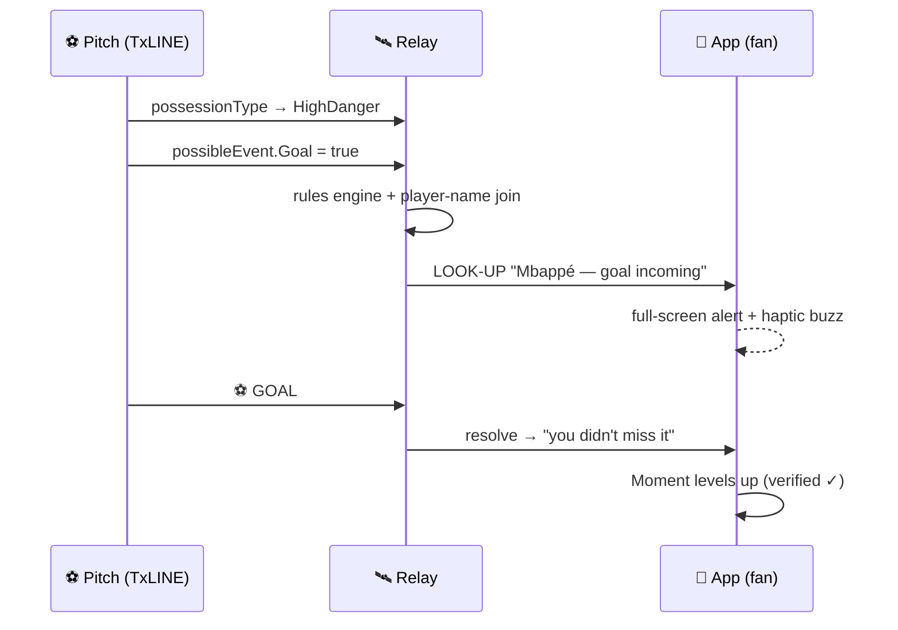
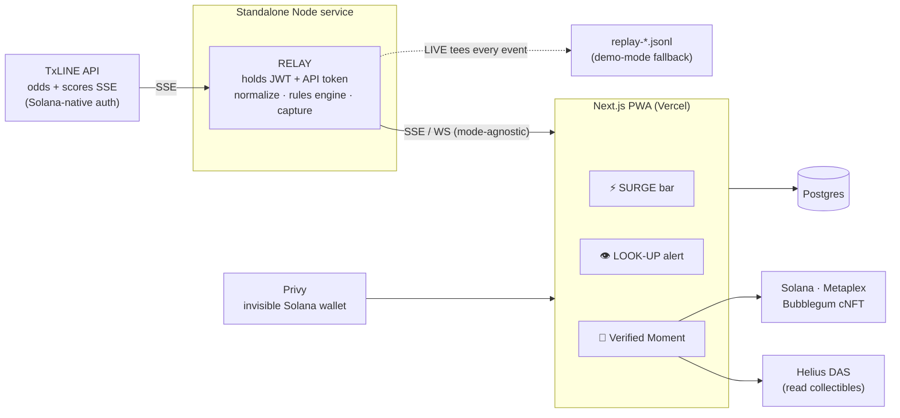

# SIXTH SENSE

> **Feel every match. See the goal coming.**
>
> A real-time World Cup companion that turns the world's live betting-market belief into a
> **number-free momentum surge**, taps you on the shoulder the instant a goal or red card is about to
> happen — **naming the player** — and mints the match's defining swing as a **provably-verified
> moment** you can share.

Built for the **TxODDS "Consumer & Fan Experiences"** track — World Cup 2026 (Superteam Earn).
Powered by **TxLINE** live sports data + **Solana**. **This is not a betting product** — no stake, no
odds to wager on, no payout. It predicts *events* ("look up, don't miss it"), never *outcomes*.

---

## The problem

Casual and diaspora fans find live odds confusing and won't bet — so the richest real-time signal in
sports (the market's live belief) is invisible to them. And every companion app demands you stare at a
second screen; nobody lets the data *detect the drama* and pull you in only when it matters.

## The solution — three layers

| Layer | What you experience | The magic |
|---|---|---|
| ⚡ **SURGE** | A directional momentum bar between the two flags. It lurches toward whoever's on top. No numbers — you *feel* who's winning the moment. | Live consensus odds (`Pct`) + possession-danger states, rendered as emotion. |
| 👁️ **LOOK UP** | Seconds before a goal, penalty, or red card, your phone buzzes: **"⚡ Mbappé — shot incoming."** Then it happens on screen. | The app reads TxLINE's hidden imminent-event signals + live lineups. The app *sees the future.* |
| 🏅 **MOMENT** | The match's defining swing becomes one evolving collectible — *"Japan survived a 9% collapse ✓"* — that levels up across the tournament. One-tap share. | A Solana cNFT whose stat is **Merkle-verified** against TxODDS's on-chain consensus. Not a screenshot — provably true. |

## How it works (the hero moment)



The data predicts a *named human's* action before the broadcast does — that's the sixth sense.

## Architecture



**Key design decisions**

- **The relay is mandatory.** Browser `EventSource` can't set TxLINE's `X-Api-Token` header, so a
  server-side relay holds the token, normalizes the stream, runs the rules engine, and fans out to the
  browser. It also keeps secrets off the client.
- **One relay, three modes — LIVE / REPLAY / MOCK — with one output contract.** The browser can't tell
  the difference, so development never depends on a live match and the deployed demo always works
  (matches end at the deadline). LIVE mode continuously captures every event to a replay file.
- **Real-time data on mainnet, our chain writes on devnet.** TxLINE's real-time tier is mainnet-only;
  our cNFT/wallet layer stays on devnet (free), decoupled.
- **Crypto is invisible.** Google login → embedded Solana wallet (Privy), gasless. No seed phrase, no
  "buy SOL." Sign-up-through-Solana is satisfied intrinsically by TxLINE's own on-chain `subscribe`.

## Tech stack

| Layer | Tech |
|---|---|
| Frontend | Next.js (latest, App Router) · TypeScript · Tailwind · mobile-first PWA |
| Auth / wallet | Privy — invisible Solana wallet, gasless |
| Real-time | Standalone Node SSE relay (Railway/Fly/Render) |
| Data | Postgres (Supabase/Neon) |
| On-chain | Solana · Anchor (devnet) · Metaplex Bubblegum v2 cNFT · Helius DAS |
| Live data | TxLINE (TxODDS) — real-time soccer scores + consensus odds |

## TxLINE integration

Auth is Solana-native: `POST /auth/guest/start` → on-chain `subscribe` (Token-2022, free WC tier) →
`POST /api/token/activate` → API token. All data calls carry `Authorization: Bearer <jwt>` +
`X-Api-Token: <token>`.

Endpoints consumed:
- `GET /api/odds/stream?fixtureId=` — consensus `Pct` (fair win-probability) → **SURGE**
- `GET /api/scores/stream?fixtureId=` — goals/cards + `possibleEvent` imminent flags + `possessionType` → **LOOK-UP**
- `GET /api/fixtures/snapshot` — match list · `GET /api/scores/stat-validation` — provable-fairness stamp

## Getting started

```bash
npm install
cp .env.example .env          # fill in Privy / Helius / DATABASE_URL

# Authenticate with TxLINE (on-chain subscribe → activate; saves .txline-session.json)
TX_NET=devnet TX_KEYPAIR_PATH=~/.config/solana/id.json npm run auth

# Run the relay + app (see scripts once added)
npm run relay                 # standalone Node SSE relay
npm run dev                   # Next.js client
```

> Secrets (`.env`, `.txline-session.json`, keypairs) are gitignored — never commit them.

## Roadmap / future vision

SIXTH SENSE is the consumer proof of a bigger product: a **white-label real-time fan-engagement layer**
broadcasters and operators (TxODDS's own customers) can drop into any match, any sport — *"our signal
tells your viewers the exact second to switch to this match."* Next: multi-sport, native push
notifications, sponsor-branded moments, and a season-long collectible identity.

## License

MIT.
