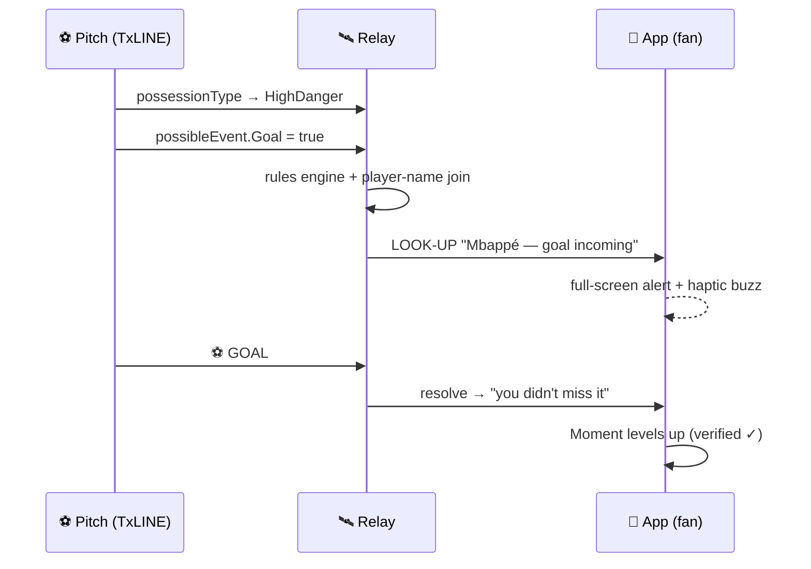
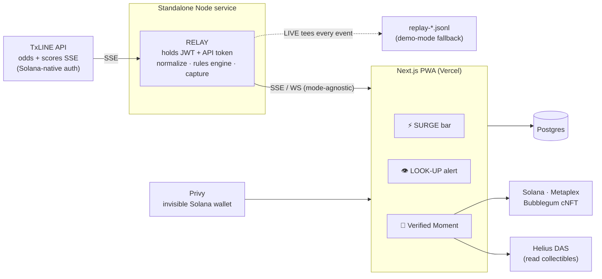

# SIXTH SENSE

> **Feel every match. See the goal coming.**
>
> A real-time World Cup companion that turns the world's live betting-market belief into a
> **number-free momentum surge**, taps you on the shoulder the instant a goal or red card is about to
> happen — **naming the player** — and mints the match's defining swing as a **provably-verified
> moment** you can share.

Built for the **TxODDS "Consumer & Fan Experiences"** track — World Cup 2026 (Superteam Earn).
Powered by **TxLINE** live sports data + **Solana**. **This is not a betting product** — no stake, no
odds to wager on, no payout. It predicts *events* ("look up, don't miss it"), never *outcomes*.

### ▶️ Live demo: **https://sixth-sense-wc.vercel.app**

Runs on a real captured live match (Argentina 3–2 Egypt) in REPLAY, so it works with no live game.
Sign in with email → pick a team → feel the SURGE → a **named LOOK-UP fires before the goal** → mint a
**real, DAS-verified** cNFT moment. See [TECH.md](./TECH.md) for the architecture + a real-match signal
analysis, and [FEEDBACK.md](./FEEDBACK.md) for TxLINE API notes.

---

## The problem

Casual and diaspora fans find live odds confusing and won't bet — so the richest real-time signal in
sports (the market's live belief) is invisible to them. And every companion app demands you stare at a
second screen; nobody lets the data *detect the drama* and pull you in only when it matters.

## The solution — three layers

| Layer | What you experience | The magic |
|---|---|---|
| ⚡ **SURGE** | A directional momentum bar between the two flags. It lurches toward whoever's on top. No numbers — you *feel* who's winning the moment. | Live consensus odds (`Pct`) + possession-danger states, rendered as emotion. |
| 👁️ **LOOK UP** | Seconds before a goal, penalty, or red card, your phone buzzes: **"⚡ Mbappé — shot incoming."** Then it happens on screen. | The app reads TxLINE's hidden imminent-event signals + live lineups. The app *sees the future.* |
| 🏅 **MOMENT** | The match's defining swing becomes one evolving collectible — *"Japan survived a 9% collapse ✓"* — that levels up across the tournament. One-tap share. | A Solana cNFT whose stat is **Merkle-verified** against TxODDS's on-chain consensus. Not a screenshot — provably true. |

## How it works (the hero moment)



The data predicts a *named human's* action before the broadcast does — that's the sixth sense.

## Does it actually work? (real-match signal analysis)

Measured on a **real mainnet capture** of the 2nd half of **Argentina 3–2 Egypt** (1,002 raw events),
run through the exact relay code the app uses:

- **495** SURGE ticks · **62** LOOK-UP signals across the half (33 sustained-danger · 26 possible-flag · 3 shot)
- **4 goals** correctly deduped from repeated feed frames → the full 0–2 → **3–2** comeback
- The **57.9′ goal was flagged ~3.1s early** by an imminent-event signal — the "precognition" moment

**Honest framing:** `possibleEvent.Goal` is an imminent-*chance* flag (~1 in 4 goals is tightly
flagged), **not** a goal predictor — which is exactly why LOOK-UP is a *drama detector, never a tip*,
and fuses **three** signals so it stays meaningful all match. Full breakdown in [TECH.md](./TECH.md#4-signal-analysis--does-it-actually-work).

## Architecture



**Key design decisions**

- **The relay is mandatory.** Browser `EventSource` can't set TxLINE's `X-Api-Token` header, so a
  server-side relay holds the token, normalizes the stream, runs the rules engine, and fans out to the
  browser. It also keeps secrets off the client.
- **One relay, three modes — LIVE / REPLAY / MOCK — with one output contract.** The browser can't tell
  the difference, so development never depends on a live match and the deployed demo always works
  (matches end at the deadline). LIVE mode continuously captures every event to a replay file.
- **Real-time data on mainnet, our chain writes on devnet.** TxLINE's real-time tier is mainnet-only;
  our cNFT/wallet layer stays on devnet (free), decoupled.
- **Crypto is invisible.** Google login → embedded Solana wallet (Privy), gasless. No seed phrase, no
  "buy SOL." Sign-up-through-Solana is satisfied intrinsically by TxLINE's own on-chain `subscribe`.

## Tech stack

| Layer | Tech |
|---|---|
| Frontend | Next.js (latest, App Router) · TypeScript · Tailwind · mobile-first PWA |
| Auth / wallet | Privy — invisible Solana wallet, gasless |
| Real-time | Standalone Node SSE relay — Railway |
| Data | Postgres — Railway |
| On-chain | Solana · Anchor (devnet) · Metaplex Bubblegum v2 cNFT · Helius DAS |
| Live data | TxLINE (TxODDS) — real-time soccer scores + consensus odds |

## TxLINE integration

Auth is Solana-native: `POST /auth/guest/start` → on-chain `subscribe` (Token-2022, free WC tier) →
`POST /api/token/activate` → API token. All data calls carry `Authorization: Bearer <jwt>` +
`X-Api-Token: <token>`.

Endpoints consumed:
- `GET /api/odds/stream?fixtureId=` — consensus `Pct` (fair win-probability) → **SURGE**
- `GET /api/scores/stream?fixtureId=` — goals/cards + `possibleEvent` imminent flags + `possessionType` → **LOOK-UP**
- `GET /api/fixtures/snapshot` — match list · `GET /api/scores/stat-validation` — provable-fairness stamp

## Getting started

```bash
# 0) TxLINE session (on-chain subscribe → activate; saves .txline-session.json)
npm install
TX_NET=mainnet TX_KEYPAIR_PATH=~/wallet.json npm run auth   # mainnet = real-time stream

# 1) Relay — standalone Node SSE service (MOCK needs no services)
cd relay && npm install && npm run dev        # :8787 ·  npm run verify for headless checks

# 2) App — Next.js PWA (new terminal)
cd app && cp ../.env.example .env.local       # fill Privy / Helius / DATABASE_URL / relay URL
npm install && npm run dev                    # :3000
```

Modes: `RELAY_DEFAULT_MODE=mock|replay|live`. The deployed demo runs `replay` against a bundled real
capture. Secrets (`.env*`, `.txline-session.json`, keypairs) are gitignored — never commit them.

## Monetization

SIXTH SENSE is the consumer proof of a **B2B white-label signal layer**: broadcasters, streamers, and
sportsbook-media (**TxODDS's own customers**) license the SURGE + LOOK-UP "switch to this match now"
overlay to pull second-screen viewers back to the broadcast at the exact moment drama is about to
happen. It's sold as a **tune-in upsell on top of data TxODDS already delivers** — no new sales motion.

- **Comparable:** [LiveLike](https://livelike.com) sells interactive fan-engagement SDKs to
  broadcasters and has raised **tens of millions** doing exactly this — proof rights-holders pay for
  engagement layers. SIXTH SENSE's edge is the *predictive, named* moment, not just polls/overlays.
- **The number:** the 2022 World Cup drew ~**5 billion** cumulative viewers; that attention leaks to
  second screens. At a modest **$10–25K / month per broadcaster** plus tune-in rev-share, across
  hundreds of national rights-holders and 104 matches, this is **seven-figure tournament ARR** — and it
  **recurs every league season** (EPL, NFL, cricket, …), not just at a World Cup.
- **Consumer funnel:** invisible-wallet onboarding + shareable verified Moments drive organic growth
  and a season-long collectible identity that keeps fans coming back.

## Roadmap / future vision

Multi-sport (the signal engine is sport-agnostic), native push notifications, sponsor-branded moments,
in-place cNFT level-up, and a leaderboard-driven fan identity across a whole tournament season.

## License

MIT.
